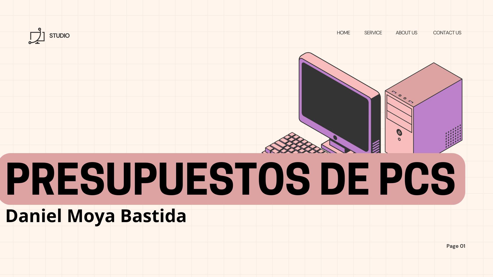

# Presupuestos para PC

### PC 1

| Tipo de Componente       | Componente                                                                 | Precio    | URL |
|--------------------------|----------------------------------------------------------------------------|-----------|-----|
| Fuente de Alimentación   | Nfortec Sagitta X 750W PCIE 5.0 80 Plus Gold Full Modular A-RGB            | 107,71€    |  [Enlace](https://www.pccomponentes.com/nfortec-sagitta-x-750w-pcie-50-80-plus-gold-full-modular-a-rgb?srsltid=AfmBOoqE3Tsjl1B3ahz-l4Gh9NoHW1C04krcvzKCeqJgPqP1q28DqPd3)  |
| Refrigeración            | Tempest Liquid Cooler 240 Kit Refrigeración Líquida Blanco   | 64,90€    |  [Enlace](https://www.pccomponentes.com/tempest-liquid-cooler-240-kit-refrigeracion-liquida-blanco?s_kwcid=AL!14405!3!599709205123!!!g!!&gad_source=1&gclid=CjwKCAjwwLO_BhB2EiwAx2e-37FcLCDPFdly7dHBOxG-pJrdFSPFLfvTXxy6a6Pd_s8LjCTxibXKMRoCSIMQAvD_BwE)   |
| Torre                    | Tempest Shade RGB Torre ATX Negra                | 59,99€    |  [Enlace](https://www.pccomponentes.com/tempest-shade-rgb-torre-atx-negra?campaigntype=eshopping&campaignchannel=shopping&gad_source=1&gclid=CjwKCAjwwLO_BhB2EiwAx2e-3zTdAiX9uEaLWx53Rfi5FYrduONUwomN4_EZkOUZ8BB2pMo2xyh8_hoCiiAQAvD_BwE)   |
| Procesador                      | AMD Ryzen 5 8500G 3.5/5GHz Box | 174,99€    |  [Enlace](https://www.pccomponentes.com/amd-ryzen-5-8500g-35-5ghz-box?srsltid=AfmBOooCS99d2y1EUkNzBOJ2_PkSI6tGqs8SdAUffEE2efWBeOrym9t9)   |
| Tarjeta Gáfica                      | AsRock Challenger D AMD Radeon RX 6600 8 GB GDDR6                       | 279,99€    |  [Enlace](https://www.pccomponentes.com/asrock-challenger-d-amd-radeon-rx-6600-8-gb-gddr6?s_kwcid=AL!14405!3!696164469795!!!g!!&gad_source=1&gclid=CjwKCAjwwLO_BhB2EiwAx2e-32cqSkIPOcLc7sNGg4HKOIUoYwMrnMjNwhjA4VbgTtTbOGIL4FqowBoChFoQAvD_BwE)   |
|SSD                 | Kioxia Exceria Plus G3 1TB Disco SSD 5000MB/S NVMe PCIe 4.0 M.2 Gen4   | 64,95€    |  [Enlace](https://www.pccomponentes.com/disco-duro-kioxia-exceria-plus-g3-1tb-disco-ssd-5000mb-s-nvme-pcie-40-m2-gen4?srsltid=AfmBOor9nsFY8TXsqwOWYi3PCXrG2G4i2yoZVRVi8qQ-aM-KTT_1PEEX)   |
|Placa Base                 | ASUS PRIME B650-PLUS WIFI  | 174,99€    |  [Enlace](https://www.pccomponentes.com/placa-base-asus-prime-b650-plus-wifi?s_kwcid=AL!14405!3!!!!x!!&gad_source=1&gclid=CjwKCAjwwLO_BhB2EiwAx2e-32Z1OkvmedxpCPT4TXgAjJ8Cvtf-bCriElk8Cw2IGILCIyyGGaYngBoCZLwQAvD_BwE)   |
|RAM               | Crucial CT16G56C46U5 DDR5 5600MHz 16GB CL46 | 40,99€    |  [Enlace](https://www.pccomponentes.com/crucial-ct16g56c46u5-ddr5-5600mhz-16gb-cl46?s_kwcid=AL!14405!3!!!!x!!&gad_source=1&gclid=CjwKCAjwwLO_BhB2EiwAx2e-30sVFYCPj6Is_oW-ctXMrYWG-zqFdd3NByFscAricZ--hky9AgSzOhoCDWYQAvD_BwE)   |
|Total            |         |           |    888,51€     |

### PC 2

| Tipo de Componente       | Componente                                                                 | Precio    | URL |
|--------------------------|----------------------------------------------------------------------------|-----------|-----|
| Fuente de Alimentación   | Nfortec Sagitta X 750W PCIE 5.0 80 Plus Gold Full Modular A-RGB            | 107,71€    |  [Enlace](https://www.pccomponentes.com/nfortec-sagitta-x-750w-pcie-50-80-plus-gold-full-modular-a-rgb?srsltid=AfmBOoqE3Tsjl1B3ahz-l4Gh9NoHW1C04krcvzKCeqJgPqP1q28DqPd3)  |
| Refrigeración            | Tempest Liquid Cooler 240 Kit Refrigeración Líquida Blanco   | 64,90€    |  [Enlace](https://www.pccomponentes.com/tempest-liquid-cooler-240-kit-refrigeracion-liquida-blanco?s_kwcid=AL!14405!3!599709205123!!!g!!&gad_source=1&gclid=CjwKCAjwwLO_BhB2EiwAx2e-37FcLCDPFdly7dHBOxG-pJrdFSPFLfvTXxy6a6Pd_s8LjCTxibXKMRoCSIMQAvD_BwE)   |
| Torre                    | Tempest Shade RGB Torre ATX Negra                | 59,99€    |  [Enlace](https://www.pccomponentes.com/tempest-shade-rgb-torre-atx-negra?campaigntype=eshopping&campaignchannel=shopping&gad_source=1&gclid=CjwKCAjwwLO_BhB2EiwAx2e-3zTdAiX9uEaLWx53Rfi5FYrduONUwomN4_EZkOUZ8BB2pMo2xyh8_hoCiiAQAvD_BwE)   | Procesador                      | AMD Ryzen 5 8500G 3.5/5GHz Box | 174,99€    |  [Enlace](https://www.pccomponentes.com/amd-ryzen-5-8500g-35-5ghz-box?srsltid=AfmBOooCS99d2y1EUkNzBOJ2_PkSI6tGqs8SdAUffEE2efWBeOrym9t9)   |
| Tarjeta Gáfica                      | AsRock Challenger D AMD Radeon RX 6600 8 GB GDDR6                       | 279,99€    |  [Enlace](https://www.pccomponentes.com/asrock-challenger-d-amd-radeon-rx-6600-8-gb-gddr6?s_kwcid=AL!14405!3!696164469795!!!g!!&gad_source=1&gclid=CjwKCAjwwLO_BhB2EiwAx2e-32cqSkIPOcLc7sNGg4HKOIUoYwMrnMjNwhjA4VbgTtTbOGIL4FqowBoChFoQAvD_BwE)   |
|SSD                 | Kioxia Exceria Plus G3 1TB Disco SSD 5000MB/S NVMe PCIe 4.0 M.2 Gen4   | 64,95€    |  [Enlace](https://www.pccomponentes.com/disco-duro-kioxia-exceria-plus-g3-1tb-disco-ssd-5000mb-s-nvme-pcie-40-m2-gen4?srsltid=AfmBOor9nsFY8TXsqwOWYi3PCXrG2G4i2yoZVRVi8qQ-aM-KTT_1PEEX)   |
|Placa Base                 | ASUS PRIME B650-PLUS WIFI  | 174,99€    |  [Enlace](https://www.pccomponentes.com/placa-base-asus-prime-b650-plus-wifi?s_kwcid=AL!14405!3!!!!x!!&gad_source=1&gclid=CjwKCAjwwLO_BhB2EiwAx2e-32Z1OkvmedxpCPT4TXgAjJ8Cvtf-bCriElk8Cw2IGILCIyyGGaYngBoCZLwQAvD_BwE)   |
|RAM               | Kingston FURY Beast RGB DDR4 3200MHz 16GB 2x8GB CL16| 56,99€    |  [Enlace](https://www.pccomponentes.com/kingston-fury-beast-rgb-ddr4-3200mhz-16gb-2x8gb-cl16?s_kwcid=AL!14405!3!!!!x!!&gad_source=1&gclid=CjwKCAjwwLO_BhB2EiwAx2e-31Rp2zdNXUDgO8ffbShxn3usrInnawi2RxiPfK_COaElhUboUFZMCRoCPFYQAvD_BwE) || Tipo de Componente       | Componente                                                                 | Precio    | URL |
| Fuente de Alimentación   | Nfortec Sagitta X 750W PCIE 5.0 80 Plus Gold Full Modular A-RGB            | 107,71€    |  [Enlace](https://www.pccomponentes.com/nfortec-sagitta-x-750w-pcie-50-80-plus-gold-full-modular-a-rgb?srsltid=AfmBOoqE3Tsjl1B3ahz-l4Gh9NoHW1C04krcvzKCeqJgPqP1q28DqPd3)  |
| Refrigeración            | Tempest Liquid Cooler 240 Kit Refrigeración Líquida Blanco   | 64,90€    |  [Enlace](https://www.pccomponentes.com/tempest-liquid-cooler-240-kit-refrigeracion-liquida-blanco?s_kwcid=AL!14405!3!599709205123!!!g!!&gad_source=1&gclid=CjwKCAjwwLO_BhB2EiwAx2e-37FcLCDPFdly7dHBOxG-pJrdFSPFLfvTXxy6a6Pd_s8LjCTxibXKMRoCSIMQAvD_BwE)   |
| Torre                    | Tempest Shade RGB Torre ATX Negra                | 59,99€    |  [Enlace](https://www.pccomponentes.com/tempest-shade-rgb-torre-atx-negra?campaigntype=eshopping&campaignchannel=shopping&gad_source=1&gclid=CjwKCAjwwLO_BhB2EiwAx2e-3zTdAiX9uEaLWx53Rfi5FYrduONUwomN4_EZkOUZ8BB2pMo2xyh8_hoCiiAQAvD_BwE)   |
| Procesador                      | AMD Ryzen 5 8500G 3.5/5GHz Box | 174,99€    |  [Enlace](https://www.pccomponentes.com/amd-ryzen-5-8500g-35-5ghz-box?srsltid=AfmBOooCS99d2y1EUkNzBOJ2_PkSI6tGqs8SdAUffEE2efWBeOrym9t9)   |
| Tarjeta Gáfica                      | AsRock Challenger D AMD Radeon RX 6600 8 GB GDDR6                       | 279,99€    |  [Enlace](https://www.pccomponentes.com/asrock-challenger-d-amd-radeon-rx-6600-8-gb-gddr6?s_kwcid=AL!14405!3!696164469795!!!g!!&gad_source=1&gclid=CjwKCAjwwLO_BhB2EiwAx2e-32cqSkIPOcLc7sNGg4HKOIUoYwMrnMjNwhjA4VbgTtTbOGIL4FqowBoChFoQAvD_BwE)   |
|SSD                 | Kioxia Exceria Plus G3 1TB Disco SSD 5000MB/S NVMe PCIe 4.0 M.2 Gen4   | 64,95€    |  [Enlace](https://www.pccomponentes.com/disco-duro-kioxia-exceria-plus-g3-1tb-disco-ssd-5000mb-s-nvme-pcie-40-m2-gen4?srsltid=AfmBOor9nsFY8TXsqwOWYi3PCXrG2G4i2yoZVRVi8qQ-aM-KTT_1PEEX)   |
|Placa Base                 | ASUS PRIME B650-PLUS WIFI  | 174,99€    |  [Enlace](https://www.pccomponentes.com/placa-base-asus-prime-b650-plus-wifi?s_kwcid=AL!14405!3!!!!x!!&gad_source=1&gclid=CjwKCAjwwLO_BhB2EiwAx2e-32Z1OkvmedxpCPT4TXgAjJ8Cvtf-bCriElk8Cw2IGILCIyyGGaYngBoCZLwQAvD_BwE)   |
|Total            |         |           |    850,53€  |

